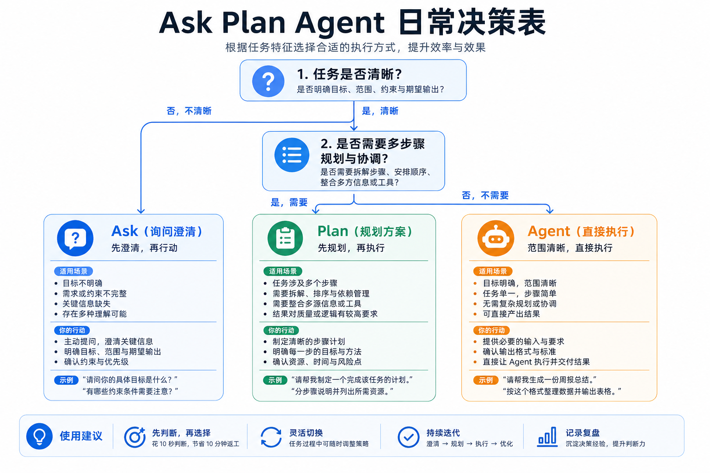
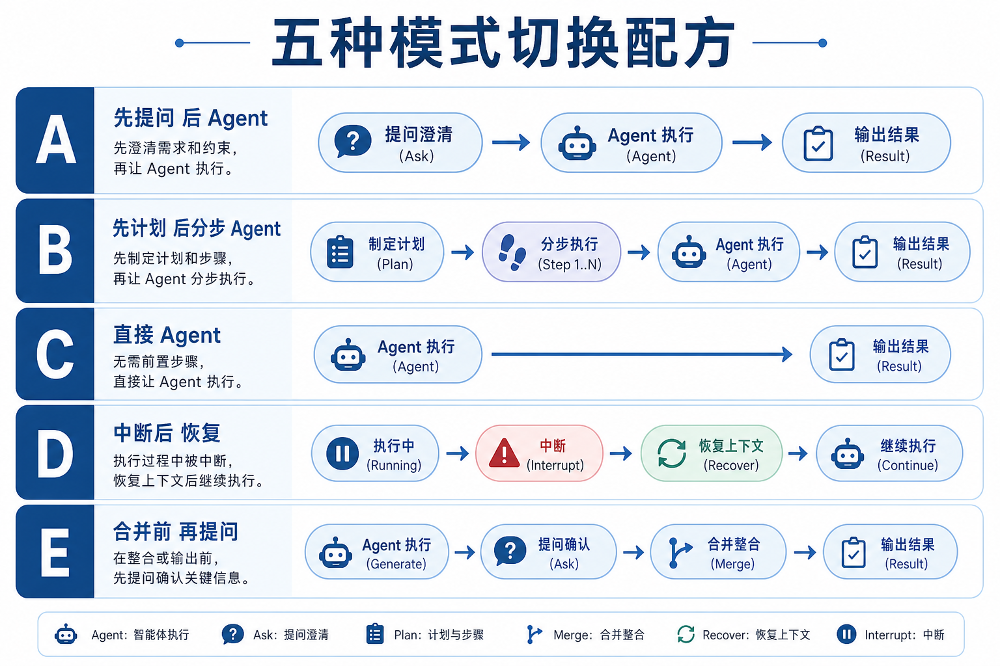

# Cursor 三种模式怎么选：Ask / Plan / Agent 日常决策表

## 六步速览

1. 先写清：目标是什么、**不要动**什么、怎样算做完
2. 拿不准、只想搞懂 → **Ask**（只读，不改仓库）
3. 步骤 ≥3、跨多文件、怕一次改炸 → **Plan**（先拆清单，对齐后再动手）
4. 规格清楚、范围可控 → **Agent**（读写文件、跑短命令）
5. 中途发现范围飘了 → **停下来**：Ask 核对或 Plan 重拆，再 Agent
6. 改完一批 → 用 Ask 对照约定做只读审查，再决定是否继续

对应三原则：**先判定再动手 · 一次只做一个范围 · 结论落盘不靠聊天记忆**。

> 说明：不同 Cursor 版本里模式入口名称可能略有差异（Ask / Plan / Agent，或等价的只读 / 规划 / 自动改码）。本文按职责划分，以你本地界面为准。

## 和站内文章的分工

站内已有《用 AI 从 0 到 1 做一个项目：Ask / Plan / Agent 协作流程》，讲的是**从想法到上线的四阶段全流程**。本文不重复那条长链路，只补日常高频决策：

| 文章 | 回答的问题 |
|------|------------|
| 0 到 1 协作流程 | 一个新项目怎么从想清楚做到做出来 |
| Cursor Rules / Skills | 长期约定与可复用工作流怎么沉淀 |
| 上下文引用实战 | 单次对话里 `@` 该喂什么 |
| **本文** | **眼前这个小任务，该开 Ask、Plan 还是 Agent？** |

## 三种模式一句话

| 模式 | 干什么 | 仓库会被改吗 | 什么时候用 |
|------|--------|--------------|------------|
| Ask | 提问、对比、挑刺、只读审查 | 否 | 需求含糊、要理解代码、要验证方案 |
| Plan | 拆步骤、列文件、标依赖与验证点 | 通常否（先对齐） | 跨模块、步骤多、怕一次做完失控 |
| Agent | 改文件、跑 `build`/`test` 等短命令 | 是 | 目标清楚、边界写清、可以验收 |

**硬习惯：**

- 需求没定 → 别开 Agent 大规模写业务代码
- 跨 3 个以上文件或目录 → 先 Plan
- Agent 改完 → 用 Ask 看有没有超范围、有没有和文档打架

## 日常决策表（先看这张）

按「你现在卡在哪」选模式：

| 你现在的状态 | 优先模式 | 下一步 |
|--------------|----------|--------|
| 「这段代码在干什么？」 | Ask | 搞懂后再决定改不改 |
| 「这个报错可能是哪类原因？」 | Ask | 列出 2～3 个假设，再 Agent 验证 |
| 「需求这句话够不够开工？」 | Ask | 不够就补规格；够了再 Plan/Agent |
| 「第一期要改哪些文件、什么顺序？」 | Plan | 确认清单后再逐步 Agent |
| 「就改这一个函数 / 一个已知文件」 | Agent | 写清负面边界即可 |
| 「既要改前端又要改接口和测试」 | Plan → 分步 Agent | 一步一验收 |
| 「Agent 越改越偏」 | 停 → Ask 或 Plan | 缩小范围或新开对话 |
| 「准备合并了」 | Ask（或审查 Skill） | 只读对照 Rules / 验收清单 |



## 五种常见任务配方

不必每次从零想。日常任务可直接套：

### 配方 A：读懂再动手（Ask → Agent）

```
Ask：这段逻辑的边界与调用链是什么？有哪些风险？
→ 你确认理解无误
→ Agent：按约定做最小改动，并列出已验证路径
```

**适合：** Bug 原因不明、接手陌生模块、担心改错层。

### 配方 B：多步改造（Plan → 分步 Agent）

```
Plan：拆成有序步骤（目标 / 依赖 / 文件 / 如何验证）
→ 你确认顺序与范围
→ Agent：每次只做清单中的一步
→ 每步跑 build/test 或手测对应条目
```

**适合：** 重构、加完整功能、前后端一起动。

### 配方 C：规格已清（直接 Agent）

```
Agent：实现「模块名」，对照「文档章节」
约束：不得超第一期；不得私增字段；最小改动
完成后列出已手动验证的路径
```

**适合：** 单文件/单模块、验收标准可勾选、你对目录很熟。

### 配方 D：越改越乱（中断恢复）

```
停止当前 Agent
→ Ask：对照最初目标，哪些改动超范围？哪些该回退？
→ Plan：给出「最小可恢复路径」
→ 新开对话 + 只 @ 关键文件，再 Agent
```

**适合：** 长对话、范围漂移、反复改同一处却更糟。

### 配方 E：合并前把关（Ask 收尾）

```
Ask：只读审查本次变更
是否超范围？是否引入未定义接口字段？是否违反项目硬约束？
```

**适合：** 提 PR 前、大改后、多人协作交接前。



## 该换模式的信号

工作中出现这些信号，就该切换，而不是硬扛：

| 信号 | 从哪换到哪 | 做法 |
|------|------------|------|
| Agent 开始「顺便」加功能 | Agent → Ask | 问：哪些超出第一期？ |
| 你说不清要改哪些文件 | 任意 → Plan | 先要文件清单与顺序 |
| Plan 步骤里出现「待确认」 | Plan → Ask | 先清待决，再继续 Plan |
| Ask 已经得出可执行结论 | Ask → Agent | 把结论写成约束再动手 |
| 对话超过很长一轮仍无验收点 | 任意 → 新开 + Plan | 结论先写入文件，再开新会话 |
| 只改文案/单行逻辑却开了大 Agent | Agent → Inline/小范围 Agent | 缩小到单文件单符号 |

## 模式选用的反例

### 反例 1：一上来就 Agent「帮我把登录做完」

**问题：** 边界、异常、鉴权方式未定，模型会脑补。

**更好：** Ask 先列待决问题 → 你拍板 → Plan 拆主路径 → Agent 打通一条。

### 反例 2：全程 Ask，从不让 Agent 改

**问题：** 讨论很充分，仓库零进展。

**更好：** Ask 只解决「不确定」；一旦可勾选，立刻 Agent 落地一小步。

### 反例 3：Plan 出了 20 步，一次性丢给 Agent「全做完」

**问题：** 中途失败难定位，diff 巨大难审。

**更好：** Plan 可以细，但 Agent **一次只领一步**，步步验收。

### 反例 4：Agent 改坏了，仍在同一长对话里继续催

**问题：** 错误上下文被反复强化。

**更好：** 停 → Ask 定位超范围改动 → 必要回退 → 新开对话只带关键文件。

## 与 `@` 引用怎么配合

模式决定「谁动手」；`@` 决定「看什么」。常用组合：

| 模式 | 建议引用 |
|------|----------|
| Ask | `@Files` / `@Code` / `@Folders`（只读分析） |
| Plan | 需求文档 + 相关目录；要求输出文件清单 |
| Agent | 精确到要改的文件/符号；写清不要动的路径 |
| 合并前 Ask | `@Git` 看 diff，对照 Rules / 验收清单 |

更细的 `@` 选用见站内：[Cursor 上下文引用实战](/articles/tools/cursor-at-context-guide)。

## 一分钟自检（发送前）

- [ ] 我现在是要「搞懂」、还是「拆步骤」、还是「改代码」？
- [ ] 若选 Agent：范围与负面边界写清了吗？
- [ ] 若跨多文件：是否先 Plan 了？
- [ ] 若对话已很长：是否该新开并让结论落盘？
- [ ] 改完后：是否安排一次 Ask 只读审查？

## 附录：Prompt 模板

### Ask：任务该用哪种模式

```text
我有一个任务如下：
【粘贴任务】

请只做模式建议，不要改代码：
1）更适合 Ask / Plan / Agent 中的哪一种？为什么？
2）若需要切换，给出推荐顺序（如 Ask → Plan → Agent）
3）开 Agent 前还缺哪些必须信息？
```

### Ask：需求是否够开工

```text
请当挑剔的同事。基于下面描述：
【粘贴需求】

列出仍会阻塞实现的待决问题；
若已可开工，明确说「可以开工」，并给出建议的第一刀范围（单模块/单路径）。
不要写代码。
```

### Plan：拆可验收步骤

```text
请把下面任务拆成有序步骤：
【粘贴任务与约束】

每步包含：目标、依赖、建议改哪些文件、如何验证。
不要直接写代码，只输出计划。
步骤尽量让「一步失败不影响已验收的上一步」。
```

### Agent：单步实现

```text
只实现计划中的第 N 步：【步骤名】
对照：【文档/计划章节】
约束：
- 不得修改步骤清单以外的文件
- 不得超出第一期范围
- 最小改动，不重构无关代码
完成后列出已手动验证的路径。
```

### Ask：合并前只读审查

```text
请只读审查本次变更（可结合 @Git）：
1）是否超出约定范围？
2）是否引入文档未定义的接口字段或配置？
3）是否有明显遗漏的失败场景？
只给问题清单与风险，不直接改代码。
```

### 中断恢复：Agent 跑偏之后

```text
请对照最初目标【一句话目标】与「明确不做」【列表】：
1）当前对话里哪些改动/建议已经超范围？
2）建议保留什么、回退什么？
3）给出恢复后的最小下一步（仍用 Ask/Plan/Agent 标明）
不要继续扩大实现范围。
```

## 延伸阅读

- 站内：用 AI 从 0 到 1 做一个项目：Ask / Plan / Agent 协作流程
- 站内：Cursor 上下文引用实战：@Files / @Folders / @Code / @Docs / @Web / @Git 怎么选
- 站内：Cursor Rules：给 Agent 的持久化项目约定
- 站内：Cursor Skills：查找、安装、创建与常用推荐
- 站内：VibeCoding — AI 协同开发经验指南
